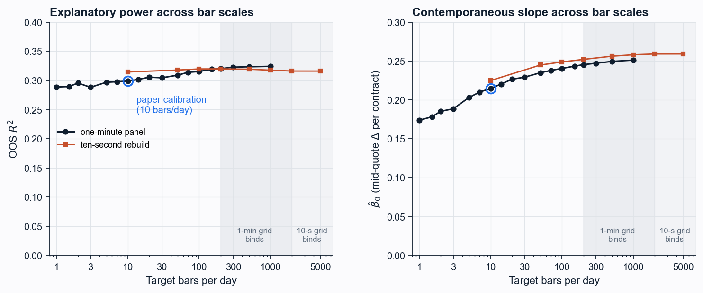

# Order Flow Imbalance and Price Impact in CME Ether Futures

Level-1 order flow imbalance (Cont, Kukanov and Stoikov, 2014) on CME Ether
futures, regressed against the bar mid-quote change on dollar-volume bars.
The paper is [`paper/eth_ofi_signal.pdf`](paper/eth_ofi_signal.pdf).

- Data: CME TBBO tick data, February 2021 to August 2026, 41,055 bars
- In sample: 2021-02 to 2023-12 (12,344 bars); out of sample: 2024-01 to 2026-08 (28,711 bars)
- Bars: one tenth of the median in-sample daily dollar volume, held fixed out of sample

## Results

Regression of bar mid-quote change on contemporaneous and one-bar lagged OFI,
Newey-West HAC errors with five lags.

| window        | bars   | beta_0  | t     | beta_1  | t      | R2   |
|---------------|-------:|--------:|------:|--------:|-------:|-----:|
| full sample   | 41,055 | +0.247  | 70.2  | -0.027  | -14.4  | 0.29 |
| in sample     | 12,344 | +0.300  | 44.9  | -0.025  | -7.0   | 0.31 |
| out of sample | 28,711 | +0.215  | 58.1  | -0.026  | -13.3  | 0.30 |

The regression is contemporaneous. Lagged OFI alone explains none of the next
bar's move (out-of-sample R2 below 0.001), so this is price impact, not a
trading signal.

Robustness to the bar scale:

- Rebuilt at eighteen targets from 1 to 1,000 bars per day, threshold
  recalibrated in sample each time: out-of-sample R2 stays in 0.29 to 0.32,
  beta_0 rises from +0.17 to +0.25 toward finer bars.
- On a ten-second grid rebuilt from raw ticks (10 to 5,000 bars per day):
  R2 0.31 to 0.32. Plain ten-second intervals, the Cont et al. grid:
  beta_0 = +0.26, t = 189, R2 = 0.32 on 1.6 million intervals.
- Estimated the way Cont et al. estimate their two-thirds, as a mean over
  half-hour subsample regressions: R2 = 0.54 (interquartile 0.48 to 0.62).
- The lag coefficient shrinks with finer bars and is zero on ten-second
  intervals (t = -0.3): netting inside coarse bars, not reversal.

Shape and state dependence:

- Impact is concave in flow: power-law exponent 0.58 (bootstrap CI 0.54 to
  0.60), consistent with the 3/5 of Almgren et al. (2005) for equity
  metaorders, though the objects differ.
- Symmetric in sign: slopes +0.215 and +0.214 on positive and negative flow
  (t = 0.06 for the difference).
- Steeper when the book is thin: 0.58, 0.76, 1.03 bp per contract across
  spread terciles (medians 2.2, 3.4, 5.9 bp); interaction t = 17, holding
  within each year (t 8.3, 8.2, 7.0), with the spread lagged one bar
  (t = 10.5), with a trailing realised-volatility control (t = 7.1), and
  within volatility terciles (t 2.8, 4.5, 5.8).

## Files

| file                  | purpose                                                       |
|-----------------------|---------------------------------------------------------------|
| `panel.py`            | per-minute OFI panel from the raw TBBO event stream           |
| `panel_sub.py`        | ten-second OFI panel, out-of-sample window, same construction |
| `robust.py`           | `rebuild_vbars_is_only` builds the IS-calibrated bar panel    |
| `signal_impact.py`    | the price-impact regression, Newey-West HAC                   |
| `bar_scale.py`        | sweep 1 to 100 bars per day                                   |
| `bar_scale_ext.py`    | sweep 150 to 1,000 bars per day, one-minute floor diagnostic  |
| `bar_scale_sub.py`    | sweep on the ten-second grid plus plain ten-second intervals  |
| `halfhour_r2.py`      | mean R2 over half-hour windows, the Cont et al. statistic     |
| `impact_shape.py`     | power-law exponent, sign asymmetry, spread terciles           |
| `spread_vol.py`       | spread effect against the volatility confound                 |
| `bar_scale_plot.py`   | figure 2 and the quarterly R2 heatmap                         |
| `plots.py`            | `fig5_impact` draws figure 1                                  |
| `minute_regression.py`| the regression at minute resolution                           |
| `decay.py`, `decay_plot.py`, `decay_robustness.py` | forward impact profile after signal events, not in the paper |
| `../shared/ofi.py`    | event OFI and front-month selection                           |
| `../shared/bars.py`   | dollar-volume bar construction                                |

Every number in the paper is written by one of these scripts to `results/`.

## Retired strategy code

An earlier version of this repository presented a momentum strategy on the
same signal. Its execution simulation priced entries before the bar that
generated them was complete, so its performance figures were not valid. The
strategy was retired and the paper rewritten around the impact measurement.
The code stays for the record: `strategy.py`, `engine.py`, `fill_sim.py`,
`walkforward.py`, `grid_sensitivity.py`, `joint_is.py`, `cost_sensitivity.py`,
`cap_sensitivity.py`, `capacity.py`, `sizing.py`, `placebo.py`,
`test_engine_golden.py`, `test_fill_timing.py`, `archive/tick_fill_sim.py`.
Nothing in the paper depends on them.

## Run

```bash
pip install numpy pandas scipy matplotlib databento

python panel.py            # raw TBBO -> per-minute panel
python robust.py           # per-minute panel -> IS-calibrated bars
python signal_impact.py    # table 1
python bar_scale.py        # 1 to 100 bars per day
python bar_scale_ext.py    # 150 to 1,000 bars per day
python panel_sub.py        # raw TBBO -> ten-second panel, out of sample
python bar_scale_sub.py    # ten-second grid sweep and plain intervals
python halfhour_r2.py      # Cont et al. design-matched R2
python impact_shape.py     # concavity, symmetry, spread terciles
python spread_vol.py       # volatility confound
python bar_scale_plot.py   # figure 2
python -c "import plots; plots.fig5_impact()"   # figure 1
```

## Data

No market data is bundled. The TBBO feed is licensed from Databento and
cannot be redistributed, so `data/` and the derived `.parquet` panels are
gitignored. `panel.py` expects the raw DBN files in `data/eth_tbbo/` at the
repository root, named `glbx-mdp3-YYYYMMDD.tbbo.dbn.zst`.

## Figures

Bar mid-quote change against contemporaneous OFI, out of sample:


Out-of-sample R2 and slope across bar scales:



## References

- Cont, R., Kukanov, A. and Stoikov, S. (2014). The price impact of order book events. Journal of Financial Econometrics, 12(1), 47-88.
- Silantyev, E. (2019). Order flow analysis of cryptocurrency markets. Digital Finance, 1(1), 191-218.
- Bieganowski, B. and Slepaczuk, R. (2026). Explainable patterns in cryptocurrency microstructure. arXiv:2602.00776.
- Almgren, R., Thum, C., Hauptmann, E. and Li, H. (2005). Direct estimation of equity market impact. Risk, 18(7), 58-62.
- Lopez de Prado, M. (2018). Advances in Financial Machine Learning. Wiley.
- Newey, W. K. and West, K. D. (1987). A simple, positive semi-definite, heteroskedasticity and autocorrelation consistent covariance matrix. Econometrica, 55(3), 703-708.
