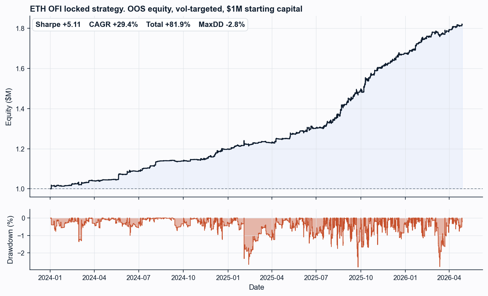
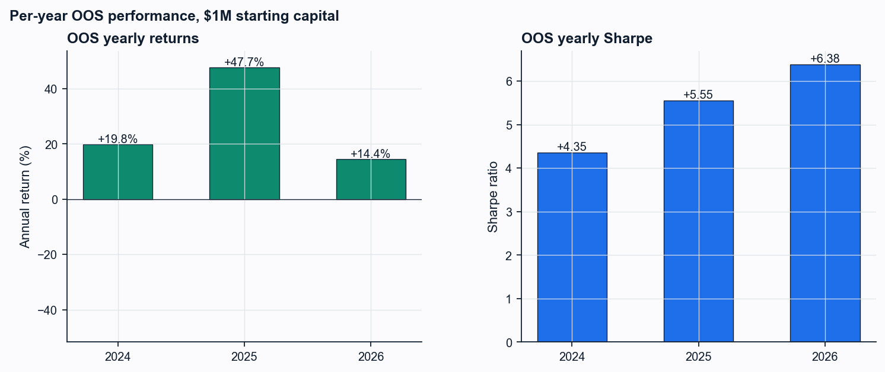
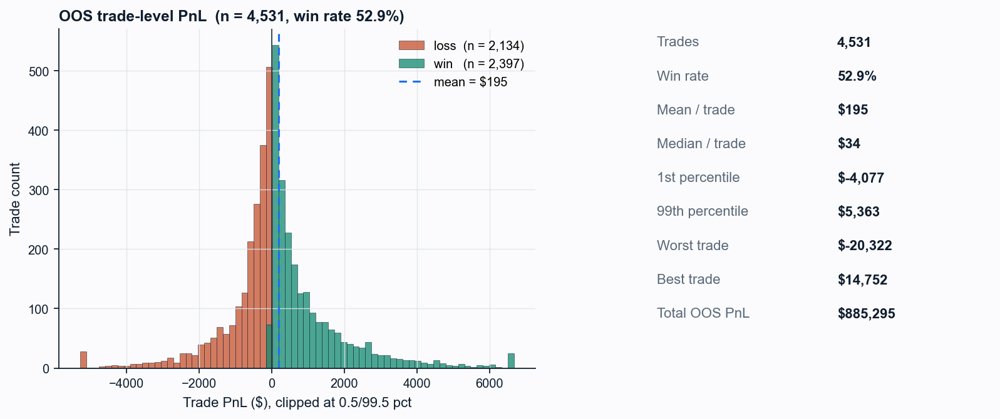
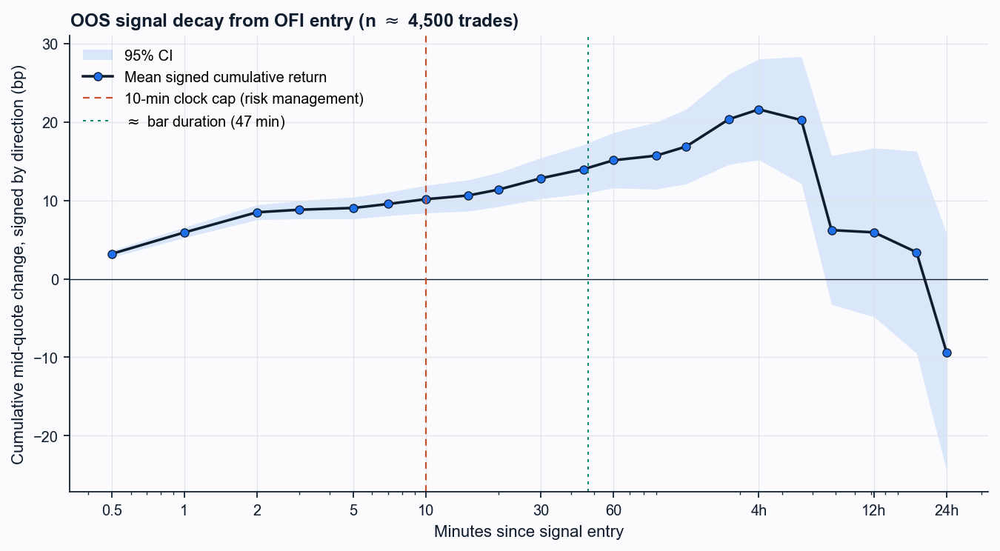
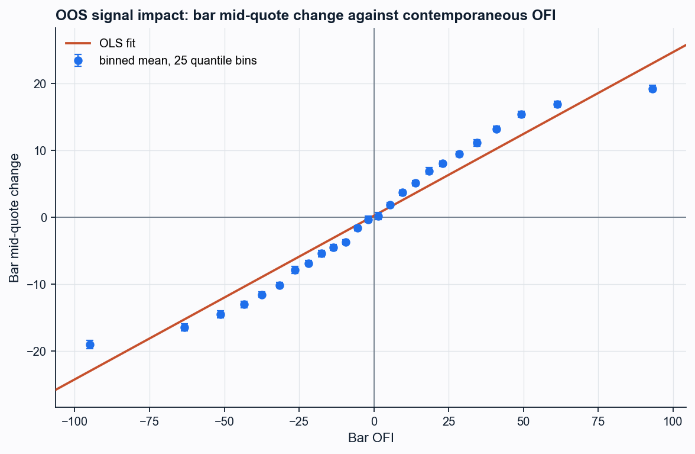
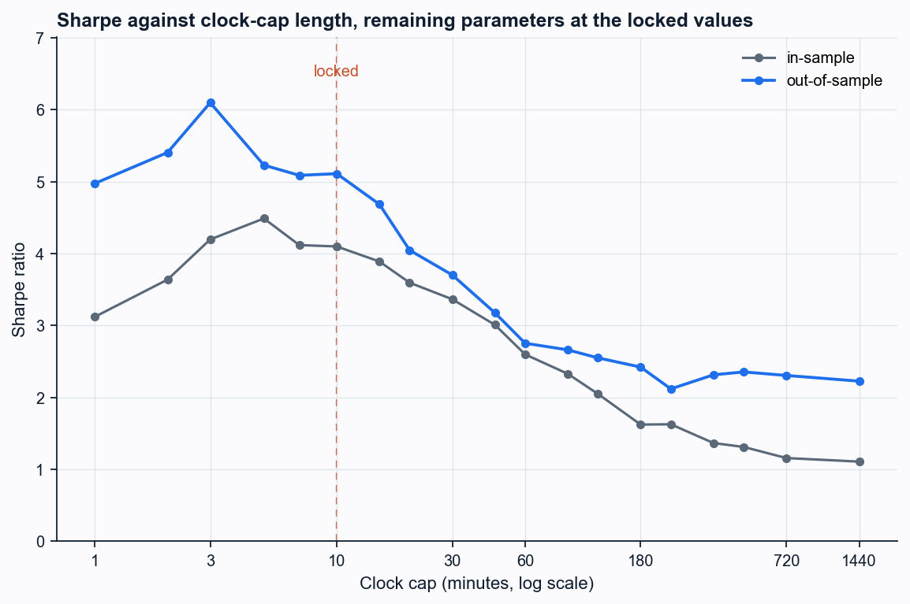

# ETH OFI Momentum Strategy

CME ETH futures momentum signal built from Cont-Kukanov-Stoikov (2014) level-1
Order Flow Imbalance, evaluated on dollar-volume bars.

- IS: Feb 2021 - Dec 2023
- OOS: Jan 2024 - Apr 2026
- Capital: $1M, 15% annualised vol target
- 4,531 round-trip trades over OOS

## Strategy

The signal is a rolling z-score of cumulative OFI over $K=5$ dollar-volume
bars with a 200-bar trailing window for the normalisation stats. Enter when
$|z| \geq 1$ in the direction of the flow. Exit when $z$ crosses 0, after
$H=3$ bars, on a contract roll, or on a 10-minute clock cap.

Locked configuration (joint IS optimum over 1,920 configurations):
$K=5$, $H=3$, entry $|z| \geq 1$, $\sigma$-lookback 200, event filter off,
weekend filter off, cap 10 minutes. Sizing is vol-targeted:
`n = 0.15 * C / (50 * mid * ann_vol)` with a floor of 1.

OFI is computed at level-1 (best bid / best offer) only, consistent with the
TBBO data source. The exact event-signing formula is in Section 2 of the
paper.

## Headline results

| metric                       | value             |
|------------------------------|-------------------|
| OOS Sharpe                   | $+5.11$           |
| OOS CAGR                     | $+29.4\%$         |
| Total OOS return             | $+81.9\%$         |
| Maximum drawdown             | $-2.8\%$          |
| Annual volatility            | $6.9\%$           |
| SPA p-value (1,920 trials)   | $< 0.001$         |
| DSR p-value (1,920 trials)   | $0.958$           |

Signal-impact regression on bar mid-quote change: OOS slope on contemporaneous
OFI is $\beta_0 = +0.249$ (Newey-West HAC $t = 52.8$, $R^2 = 0.32$). Forward
signed return from signal entry rises rapidly over the first 2 minutes
($\approx 4$ bp/min), peaks at +21.6 bp at 4 hours, and decays to $-9.4$ bp
by 24 hours. The 10-minute cap is an IS-optimal vol-control parameter, not
a signal-decay cutoff.

## Cost sensitivity

| ticks/side | bp/side | OOS Sharpe | CAGR    | MaxDD  |
|-----------:|--------:|-----------:|--------:|-------:|
|  0.0       |  0.00   |  $+5.43$   | $+31.0\%$ |  $-2.7\%$ |
|  0.5       |  0.08   |  $+5.27$   | $+30.2\%$ |  $-2.8\%$ |
|  **1.0**   |  **0.16**| **$+5.11$**| **$+29.4\%$**| **$-2.8\%$** |
|  2.0       |  0.31   |  $+4.79$   | $+27.9\%$ |  $-2.9\%$ |
|  3.0       |  0.47   |  $+4.47$   | $+26.3\%$ |  $-3.0\%$ |
|  5.0       |  0.78   |  $+3.84$   | $+23.0\%$ |  $-3.2\%$ |
| 10.0       |  1.56   |  $+2.25$   | $+14.2\%$ |  $-3.6\%$ |
| 20.0       |  3.12   |  $-0.91$   |  $-6.6\%$ | $-18.6\%$ |

Computed on the locked strategy. 1 ETH tick = $2.50 / contract = ~0.16 bp at
a typical front-month price. The headline row at 1 tick/side corresponds to
colocated passive execution; the empirical fill simulation in `fill_sim.py`
shows aggressive book-walking gives Sharpe $+3.77$ and passive execution at
the touch gives $+3.49$ on the legs that fill.

## Files

| file                  | purpose                                                                   |
|-----------------------|---------------------------------------------------------------------------|
| `panel.py`            | Build the per-minute OFI panel from the raw TBBO event stream             |
| `strategy.py`         | Locked strategy: signal, state machine, PnL conventions                   |
| `robust.py`           | IS-only dollar-volume bars, then DSR / Hansen SPA / block bootstrap on the 96-config grid |
| `joint_is.py`         | Full 1,920-config joint IS sweep with SPA and DSR                         |
| `signal_impact.py`    | OLS of bar mid-quote change on OFI with Newey-West HAC SEs                |
| `decay.py`            | Sub-bar to 24h signal decay profile from raw TBBO                         |
| `decay_plot.py`       | Decay-profile figure                                                      |
| `cost_sensitivity.py` | OOS Sharpe under a flat per-side tick cost                                |
| `cap_sensitivity.py`  | IS and OOS Sharpe across clock-cap lengths                                |
| `fill_sim.py`         | Empirical fill simulation: aggressive / passive / staggered               |
| `tick_fill_sim.py`    | Worst-case market-order tick-fill reference                               |
| `capacity.py`         | Almgren-Chriss capacity sweep, $1M-$50M                                   |
| `sizing.py`           | Fixed vs vol-target sizing comparison                                     |
| `placebo.py`          | Direction-shuffled placebo over 200 seeds                                 |
| `plots.py`            | Paper figures: equity, yearly, trades, signal impact, cap sweep           |

## Run

```bash
pip install numpy pandas scipy matplotlib databento

# Build the panel from raw TBBO (Databento subscription required):
python panel.py             # raw TBBO -> per-minute panel
python robust.py            # per-minute panel -> IS-fixed bars, then DSR / SPA / bootstrap

# Core analyses:
python strategy.py          # locked strategy
python signal_impact.py     # signal-impact regression
python decay.py             # sub-bar to 24h signal decay
python joint_is.py          # 1,920-config joint IS sweep + SPA + DSR
python cost_sensitivity.py  # flat per-side cost sweep
python cap_sensitivity.py   # clock-cap length sweep
python fill_sim.py          # empirical fill sim (aggressive/passive/staggered)
python tick_fill_sim.py     # worst-case tick-fill reference
python capacity.py          # capacity at scale
python sizing.py            # fixed vs vol-target sizing
python placebo.py           # direction-shuffled placebo

# Figures:
python plots.py             # equity, yearly, trades, impact, cap-sweep figures
python decay_plot.py        # decay-profile figure
```

## Data

No market data is bundled. The raw TBBO feed is licensed from Databento and
cannot be redistributed, so `data/` and the derived `.parquet` panels are
gitignored. `panel.py` expects the raw Databento DBN files in a
`data/eth_tbbo/` directory at the repository root (sibling to `eth/`), named
`glbx-mdp3-YYYYMMDD.tbbo.dbn.zst`. With a Databento subscription you can pull
the same CME ETH TBBO history and rebuild the panel from scratch. `robust.py`
writes the dollar-volume bar panel to `results/` on first run, and the
downstream scripts read from there.

## Figures

OOS equity curve, $1M starting capital:



Per-year breakdown:



Trade-level PnL distribution:



Signal decay profile, sub-bar to 24 hours:



Bar mid-quote change against contemporaneous OFI:



Sharpe against clock-cap length:



## References

- Cont, R., Kukanov, A., Stoikov, S. (2014). The price impact of order book events.
- Bailey, D., Lopez de Prado, M. (2014). The deflated Sharpe ratio.
- Hansen, P. (2005). A test for superior predictive ability.
- Almgren, R., Chriss, N. (2000). Optimal execution of portfolio transactions.
